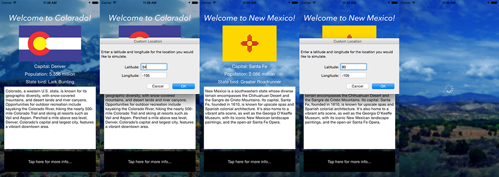

Super simple geofencing for iOS applications.

####So why Geofencing over CoreLocation's Region Monitoring?

CoreLocation attempts to ease the implementation of geofences with their region monitoring methods. However, these methods are targetted more at developers who want to incorporate iBeacons into their applications, which are costly, and require physical installation. Geofences are digitally deployable, instant, and free.

CoreLocation does allow geofences of CLCircularRegion objects. However, these regions are simple circles, and CoreLocation only allows you to monitor up to 20 at a time.

Geofencing handles geofences differently. Monitor as many CLCircularRegion or complex MKPolygon objects as you'd like using a simple block-based design, and recieve a callback of these objects whenever the user either enters or exits any of the implemented geofences.


In the included demo, changing a user's location to one that is inside of the geographical boundaries of one of the southwestern US states in the Four Corners changes the information on the travel guide for the corresponding state. Exiting all boundaries hides the interface altogether.

####Using Geofencing to Monitor Regions

Implementing Geofencing is easy. Start by declaring the MKPolygon and CLCircularRegion objects you'd like to monitor and add them to an array. This array can also be made on the fly.

```objective-c
// Create an array of the geofences you want to monitor
    NSMutableArray *southWesternStates = [[NSMutableArray alloc] init];
    GFGeofence *utah = [[GFGeofence alloc] initFromMKPolygon:[StateHelper MKPolygonForUtah] andIdentifier:@"Utah"];
    [southWesternStates addObject:utah];
    
    GFGeofence *arizona = [[GFGeofence alloc] initFromMKPolygon:[StateHelper MKPolygonForArizona] andIdentifier:@"Arizona"];
    [southWesternStates addObject:arizona];
    
    GFGeofence *colorado = [[GFGeofence alloc] initFromMKPolygon:[StateHelper MKPolygonForColorado] andIdentifier:@"Colorado"];
    [southWesternStates addObject:colorado];
    
    GFGeofence *newMexico = [[GFGeofence alloc] initFromMKPolygon:[StateHelper MKPolygonForNewMexico] andIdentifier:@"New Mexico"];
    [southWesternStates addObject:newMexico];
```

In the code example, note that there is a helper object that is defining the actual coordinates of each polygon and returning an MKPolygon through a class method. This object is included in the demo.

Next set up the Geofencing object. It is best to declare the Geofencing object in the @interface of your ViewController. Then begin the [fencing monitorRegions:] method to start monitoring. Determine the code that is executed for both enter and exit events. Neither of these events can be nil at this point, so to do nothing, simply run an empty function through the block.

```objective-c
// Set up a Geofencing object and start monitoring
    fencing = [[Geofencing alloc] init];
    [fencing monitorRegions:southWesternStates onEnter:^(NSArray *regions) {
        // Handle and identify fence enter events
        for (GFGeofence *fence in regions) {
            NSLog(@"You've entered %@!", fence.identifier);
        }
    } onExit:^(NSArray *regions){
        for (GFGeofence *fence in regions) {
            NSLog(@"You've exited %@!", fence.identifier);
        }
    }];
```