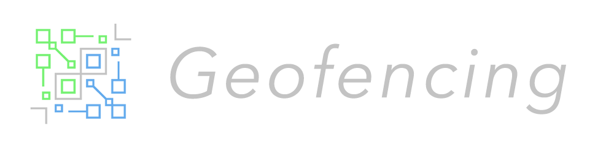

# Geofencing

### A Cocoa Library That Makes Multi Geofencing a Breeze

Monitor infiniate amounts of geofences, whether they be CLRegions, or MKPolygons.

####So why Geofencing over CoreLocation's Region Monitoring?

Firstly, CoreLocation relies on delegate methods to handle asynchronous events, which become messy, especially if you are entering and exiting a lot of locations. It also requires a lot of set up and finicking compared to CoreLocation's location updates. This may be because region monitoring includes / overlaps with iBeacon features. It seems that Apple wrote this section of the library with this technology in mind. iBeacons are great, if you have the $$$ and time to implement them. Geofences are free and instantly deployable internationally.

Also, CoreLocation only allows you to monitor up to 20(!!?) regions at a time, which is unreasonable if you have more than 20 regions to monitor. Geofencing allows you to monitor as many regions as you want.

Lastly, CoreLocation only supports CLRegions, which include iBeacon regions, and literal circles. If your area is a complex polygon that spans an intricate tract of land, you simply cannot geofence it with the current libraries.

That's why I am developing Geofencing. After the headaches of trying to get some simple GPS functionality working across a group of locations, I figured that others out there are probably having the same problem.

####Who uses Geofencing?

No one, yet. But if you do, send me an email so I feel good about myself.